# Explainable AI for Image Classification using Twin System and Grad-CAM

**Author:** Aryan Jain    
**Date:** May 17, 2025

---

## 🧠 Introduction

Explainable Artificial Intelligence (XAI) is crucial in making machine learning models interpretable and trustworthy, especially in high-stakes or opaque domains. In this project, I applied two complementary post-hoc XAI techniques to a binary image classification problem — distinguishing between **real** and **AI-generated** (fake) cat images.

The objective was two-fold:

1. Build a strong classifier using a fine-tuned ResNet-18 model.
2. Reveal the "why" behind its predictions using visual and example-based explanations.

---

## 🧰 XAI Techniques Used

### 🔥 Grad-CAM (Gradient-weighted Class Activation Mapping)

Grad-CAM highlights which parts of an image are most influential for the model's prediction. It works by backpropagating gradients to the final convolutional layers to generate heatmaps. These maps help users verify whether the model is focusing on the correct regions (e.g., ears, eyes, textures) — or being misled.

✅ **Why use it?**  
To visualize the evidence used by the network for classification decisions.

📄 [Grad-CAM Paper](https://arxiv.org/abs/1610.02391)

---

### 🧠 Twin System (Case-Based Reasoning with Embeddings)

The Twin System explains model predictions by retrieving visually similar training samples with the same predicted class. It computes cosine similarity between embeddings from the penultimate layer (`avgpool`) and shows the "nearest neighbors" from the training set.

✅ **Why use it?**  
To provide intuitive, example-based justification — similar to how a radiologist compares a scan with past known cases.

📄 Based on: [This Looks Like That (2018)](https://arxiv.org/abs/1806.10574)

---

## 📊 Dataset

- **Total Images:** 300
  - 150 Real cat images from public datasets
  - 150 Fake images generated using [`google/ddpm-cat-256`](https://arxiv.org/abs/2006.11239)

### Preprocessing

- Resized to `224x224`
- Normalized using mean and std = 0.5 (CIFAR-style)

### Train/Validation Split

- **Training:** 100 real + 100 fake
- **Validation:** 50 real + 50 fake

---

## 🏗️ Model Architecture

- **Backbone:** Pretrained ResNet-18
- Final layer modified for 2-class output (real vs. fake)

### Training Configuration

- Optimizer: Adam (`lr=1e-4`)
- Loss Function: CrossEntropyLoss
- Epochs: 10
- Batch Size: 32

✅ **Final Validation Accuracy:** 91%

---

### 📈 Evaluation Metrics

- **Accuracy:** 91%
- **Precision (Real):** 0.94, **Recall (Real):** 0.88
- **Precision (Fake):** 0.89, **Recall (Fake):** 0.94
- **F1 Score (Both):** 0.91

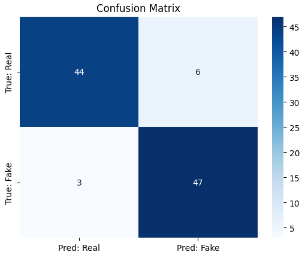

---

## 🔬 Experiments

### 🔍 Grad-CAM Visualizations

Visual saliency maps for real and fake image samples:

- 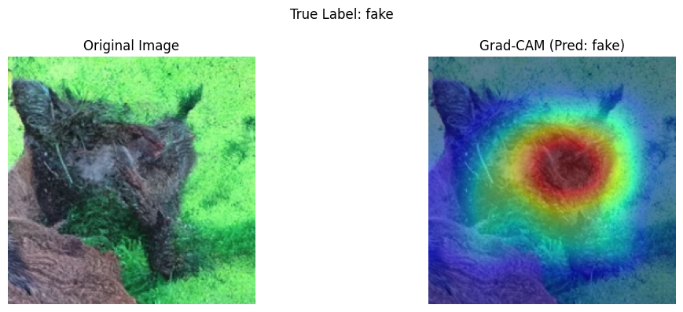
- 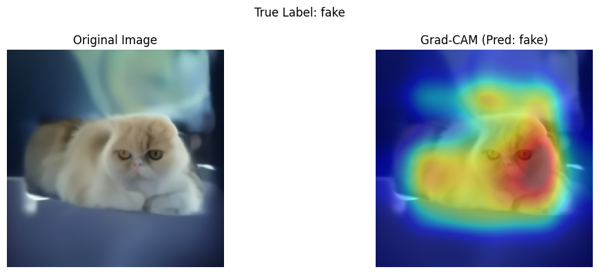
- 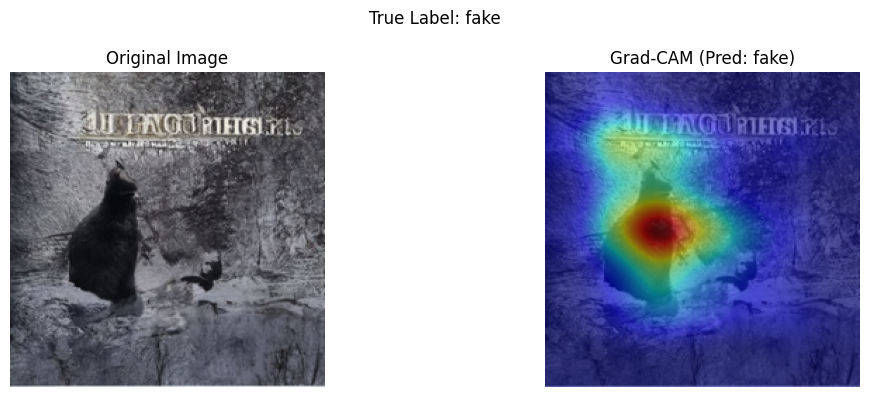
- 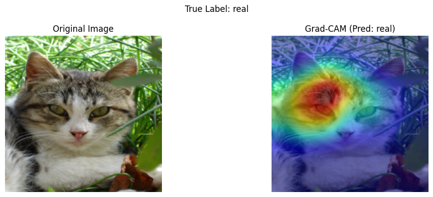
- 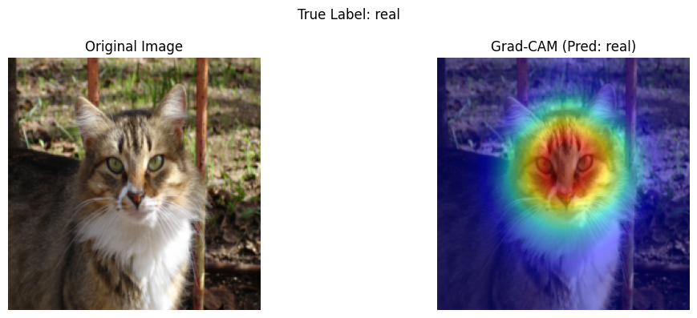
- 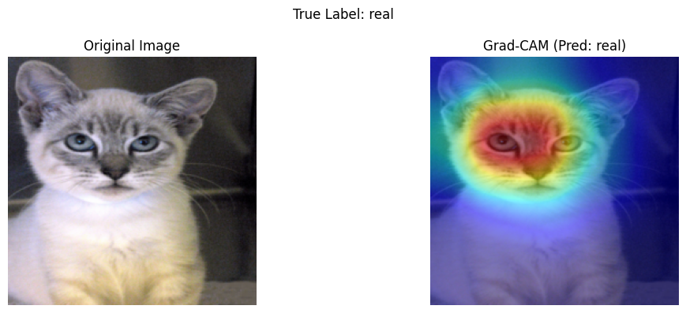

These overlays revealed that the model often attended to fur patterns, eye shapes, and ear positions for its predictions.

---

### 🧠 Twin System Visualizations

Twin explanations retrieved training examples similar to a test image **from the same predicted class**, validating the classifier's reasoning.

- 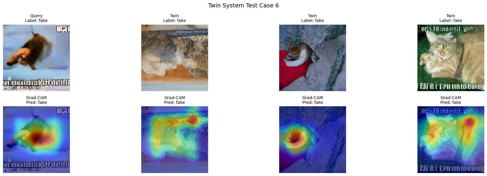
- 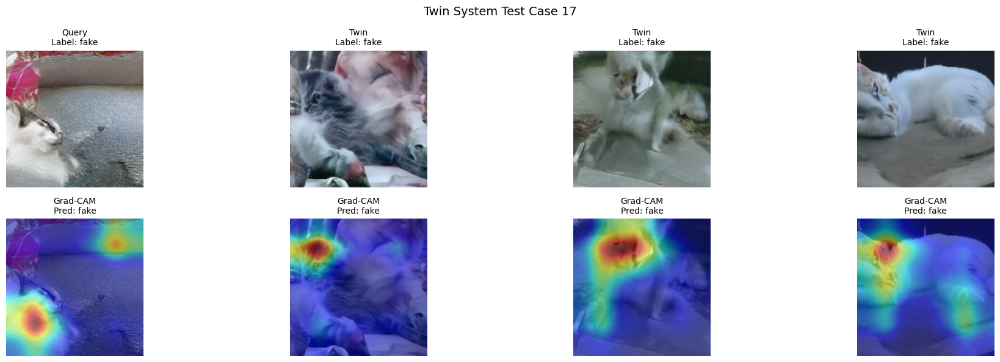
- 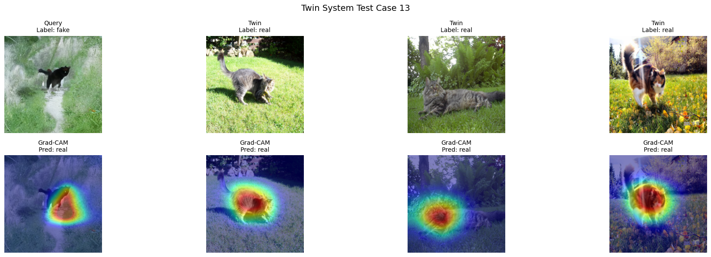
- 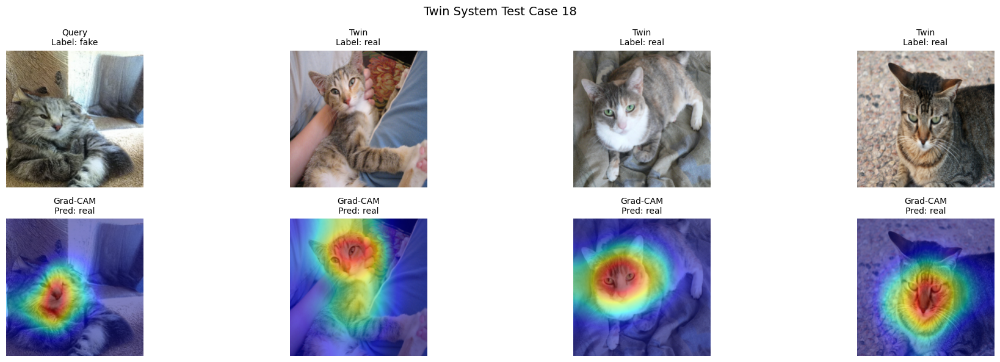
- 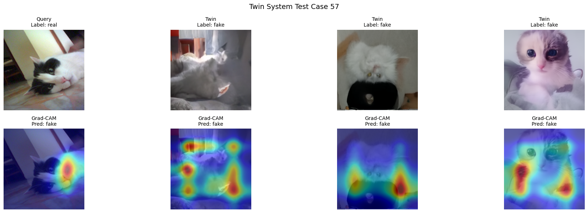
- 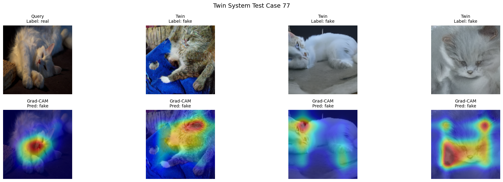

---

### ❌ Misclassification Analysis

- **Real ➡ Fake (False Negatives):** `[13, 18, 22, 34, 40, 44]`
- **Fake ➡ Real (False Positives):** `[57, 77, 80]`

Grad-CAM and Twin System helped investigate these edge cases. In many cases, blur or unusual poses in real images confused the classifier.

---

## ✅ Conclusion

By combining Grad-CAM with the Twin System, this project achieved a richer interpretability framework:

| Technique | Purpose | Value |
|----------|---------|-------|
| **Grad-CAM** | Pixel-level explanation | Shows *where* the model is looking |
| **Twin System** | Example-based reasoning | Shows *why* via similarity to past cases |

This multi-view approach fosters transparency and trust in AI-powered image classifiers.

---

## 🚀 Future Work

- Introduce **counterfactual explanations** (e.g., nearest neighbors from the opposite class)
- Replace cosine similarity with **CLIP embeddings** for semantic similarity
- Improve Twin System with a **ProtoPNet architecture**

---

### 🧪 ProtoPNet Attempt

- Architecture: ResNet-18 backbone with 10 learned prototypes per class
- Goal: Learn localized regions (patches) that support classification

#### Results

- **Validation Accuracy:** 50%
- **Problem:** Overfitted to "real" class due to prototype imbalance

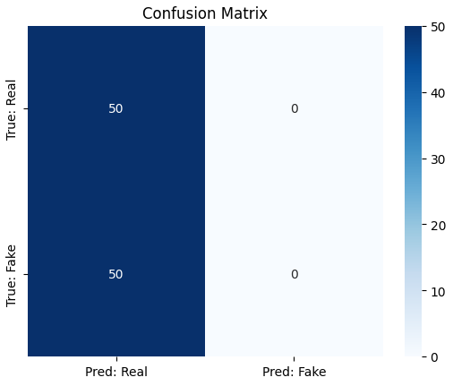

#### Learned Prototypes

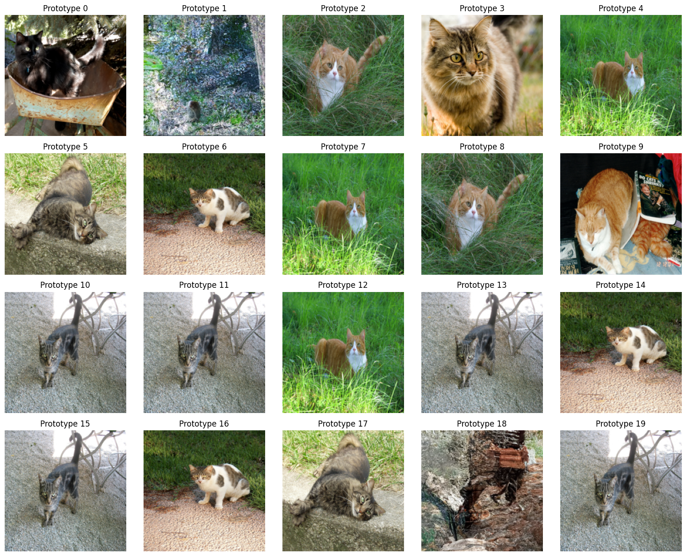

Despite underperformance, I successfully:

- Trained the ProtoPNet architecture
- Projected prototypes to most activating image patches
- Visualized top-activating examples for each prototype

Future work will address class imbalance and refine prototype usefulness.

---

## 🧾 References

- [Grad-CAM: Visual Explanations from Deep Networks](https://arxiv.org/abs/1610.02391) - Selvaraju et al., ICCV 2017  
- [Denoising Diffusion Probabilistic Models](https://arxiv.org/abs/2006.11239) - Ho et al., NeurIPS 2020  
- [TorchCAM Library](https://frgfm.github.io/torch-cam/)  
- [This Looks Like That](https://arxiv.org/abs/1806.10574) - Chen et al., 2018  
- [Case-Based Interpretable DL for Mammography](https://www.nature.com/articles/s42256-021-00400-0) - Barnett et al., Nature Machine Intelligence, 2021  
